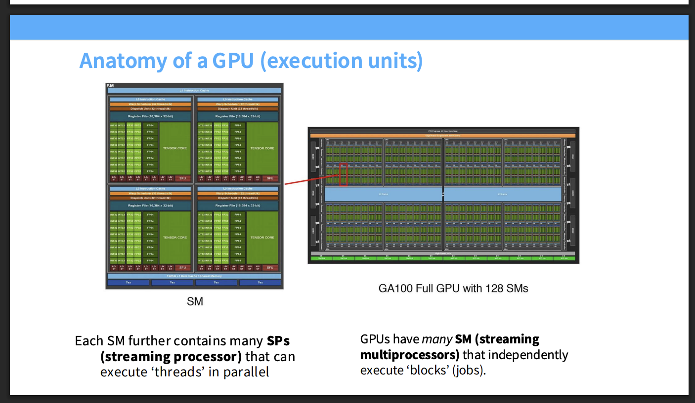
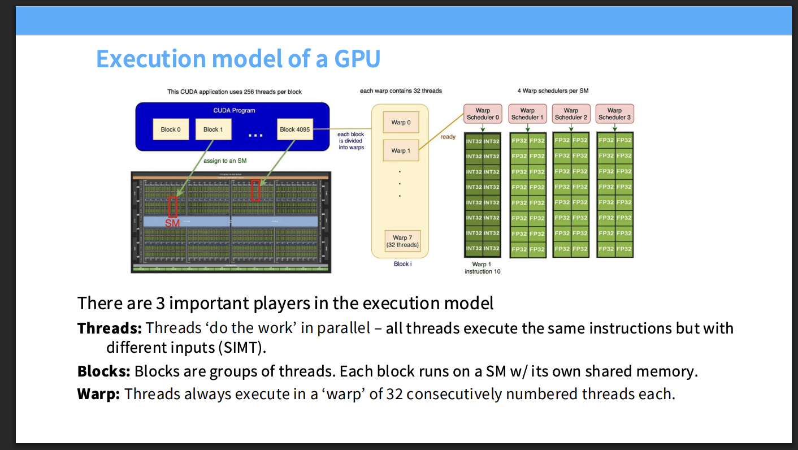
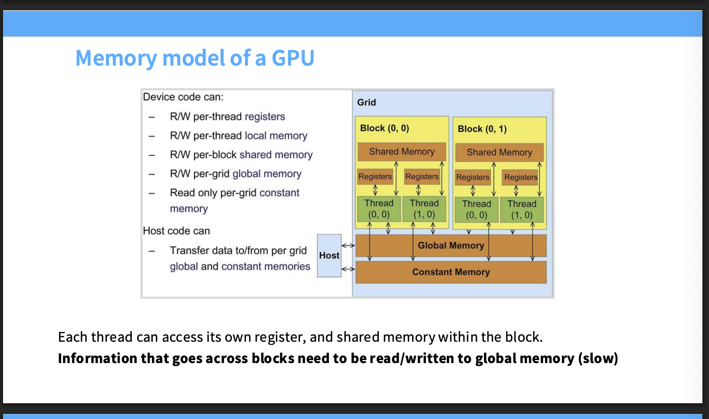
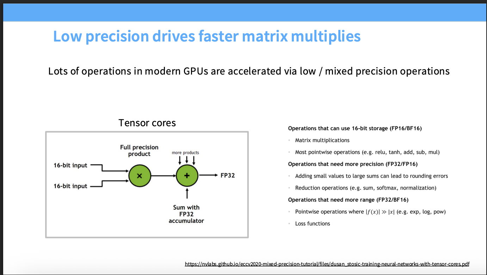
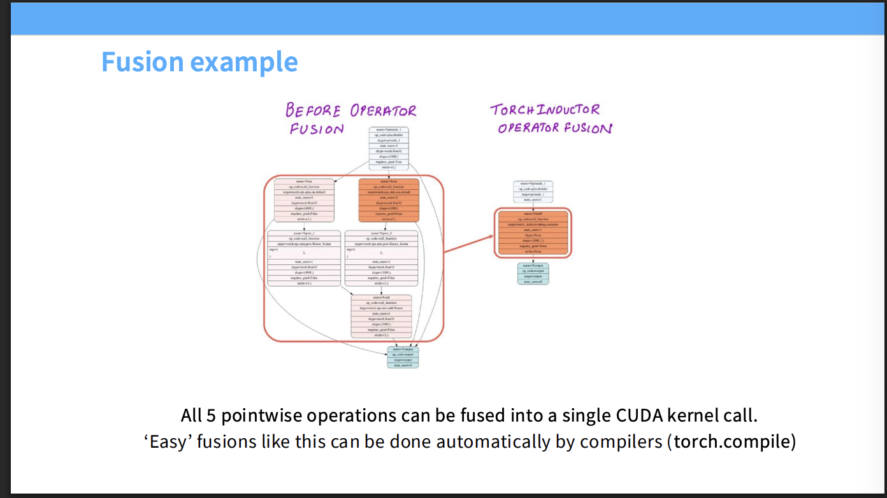
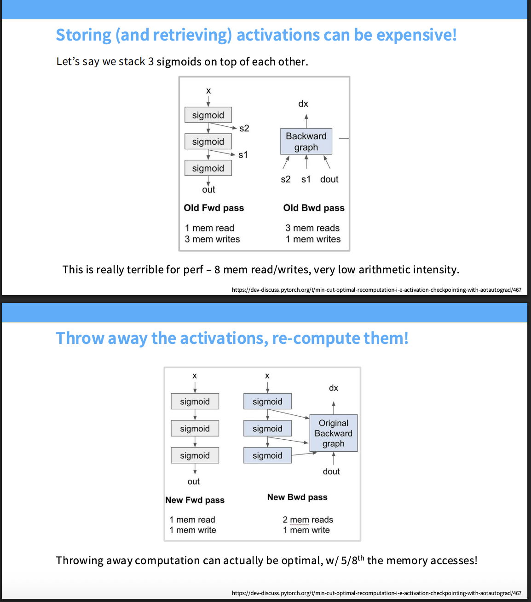
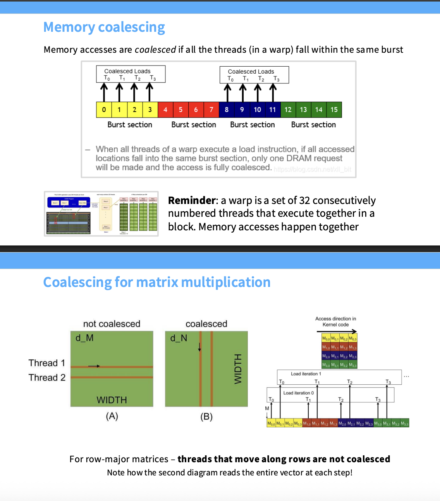
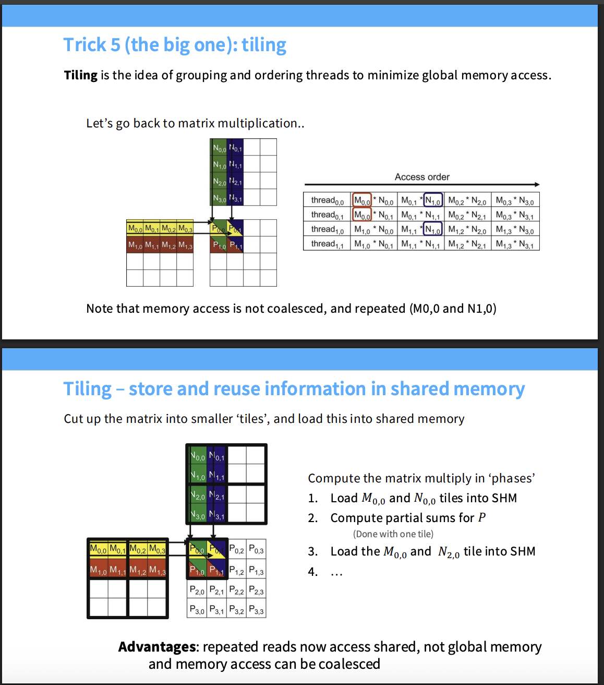
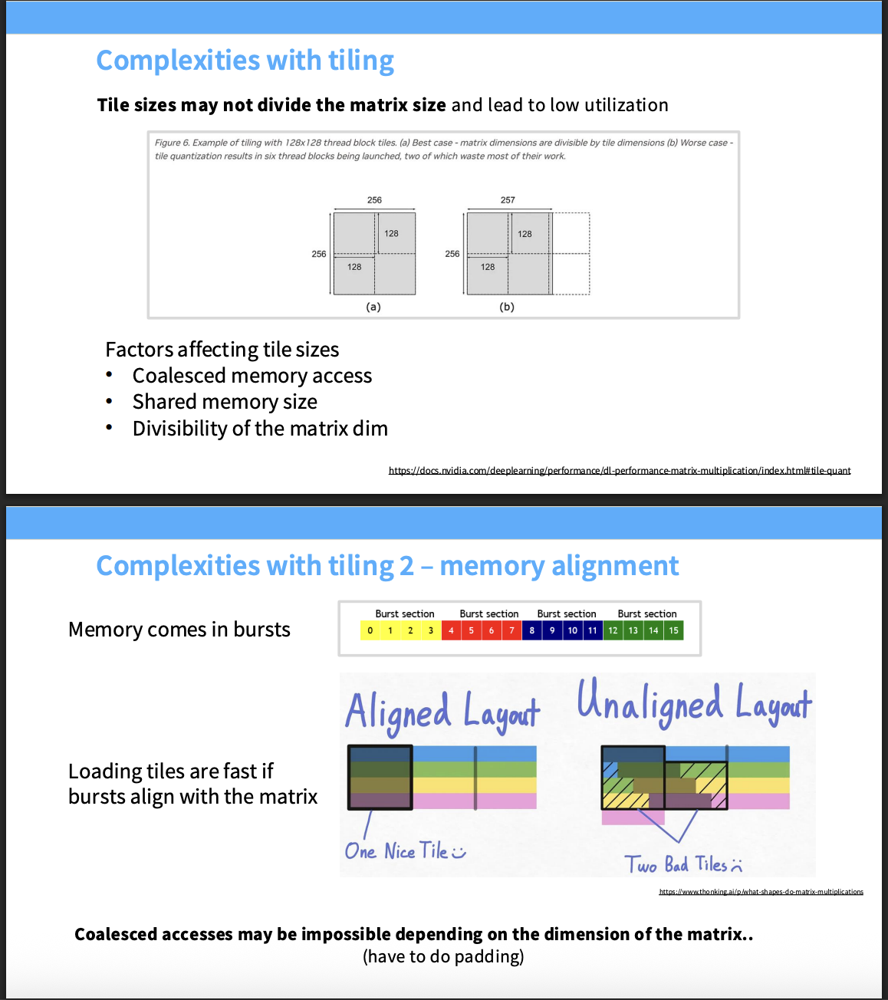
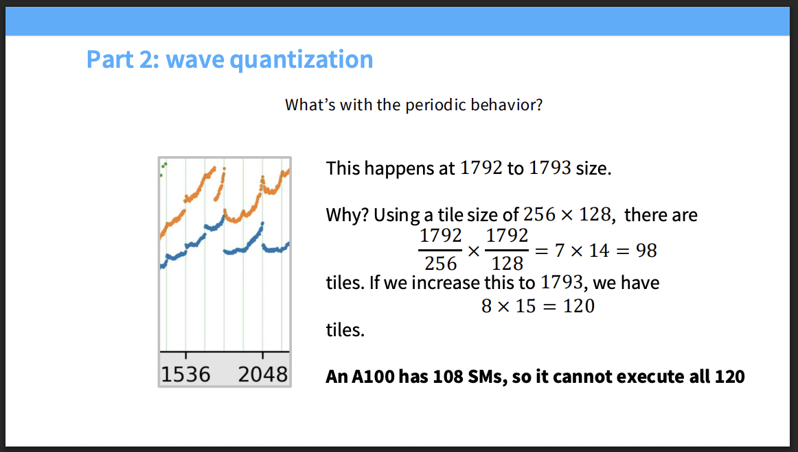

# Lecture 5 GPUs

今天看了一下cs336的lecture 5

- **海量的 SM (Streaming Multiprocessors)**：上图展示的是一个完整的 GA100 GPU 芯片架构，你可以看到它被划分成了许多个小矩形，GA100 完整版总共包含了 **128 个 SMs** 。  
- **任务映射**：在执行层面上，GPU 拥有许多这样的 SM，它们可以独立地执行宏观的任务组，也就是我们常说的 **"blocks"** 。
- 每个 SM 内部进一步包含了许多 **SPs（流式处理器）** ，Tensor core 是专门用于矩阵乘法的模块，sp负责执行最细粒度的threads

### GPU的三个主要组成部分

- **Threads（线程）**：这是真正在最前线“干活”的最小计算单元 。GPU 采用了 SIMT（单指令多线程）架构，这意味着大量的线程会并行执行**完全相同**的代码指令，只不过每个线程处理的输入数据是不同的 。  

- **Warps（线程束）**：这是 GPU 硬件层面上真正用于调度的基本单位 。GPU 并不是逐个线程去分配任务的，而是强制将 **32 个连续编号的线程**紧紧捆绑在一起，组成一个 Warp 。这 32 个线程在物理上必须同进同退。  

- **Blocks（线程块）**：这是比 Warp 更大一级的逻辑分组，由一组线程构成 。在调度时，一整个 Block 会被整体分配到某一个具体的 SM（流式多处理器）上运行 。同一个 Block 内的所有线程有一个专属的优势：它们可以互相协作，并共享该 SM 内部超高速的**共享内存 (Shared Memory)** 。

- 每个 Block 包含 **256 个线程** 。当 Block 进入 SM 后，会被严格按照每 32 个线程一组进行切分，也就是拆成了 8 个 Warps

  ### gpu的内存模型

- **线程私有空间 (Thread Level)**：每个线程 (Thread) 都有自己专属的**寄存器 (Registers)** 和本地内存 (Local memory) 。这是读写速度最快的地方，但也是绝对私有的。  

- **线程块共享空间 (Block Level)**：这是一个极其关键的区域！同一个 Block 里的所有线程，可以共同读写一块**共享内存 (Shared Memory)** 。它的速度非常快（是在芯片上的 SRAM），是同一个 Block 内的线程互相通信、交换数据的核心枢纽。  

- **全局可见空间 (Grid Level)**：也就是图中间巨大的 **全局内存 (Global Memory)** 和常量内存 (Constant Memory) 。整个 GPU 的所有 Block 都能读写全局内存 。但是它有一个致命缺点：读取速度慢 。如果 Block A 需要把计算结果交给 Block B 处理，信息必须通过缓慢的全局内存来中转 。

  cpu只能把数据送到gpu的全局内存中

### 所以我们要怎么才能使得gpu计算得更快呢？

1. #### Control divergence

由于gpu是使用SIMT模型，同一个Warp里的32个线程必须在同一时刻执行完全一样的指令，但是可以处理不同的数据，这也和下文中的Coalescing memory相关。但是在这里，如果代码出现了if/else分支，就会发生control divergence

GPU 无法让一部分核心去算 `if` 里的加法，同时让另一部分核心去算 `else` 里的乘法。硬件只能采取妥协方案。它会先激活满足 `if` 条件的线程去执行代码（比如操作 `A` 和 `B`），而此时不满足条件的线程只能挂起闲置 。等 `if` 分支执行完，GPU 再切换过来，激活刚才闲置的线程去执行 `else` 分支的代码直到两个分支都分别执行完毕，这 32 个线程才会重新汇合，一起继续执行后续的代码。

因此写cuda代码就应该尽量让一个warp里的线程走一个逻辑分枝。

2. #### Low precision computation

   

   这没什么好说的，使用混合精度或者使用fp16能显著降低内存占用并且加速计算

3. #### Operator fusion 

   

   左侧的图在传统pytorch动态图下，会触发5次独立的CUDA Kernel的调用。也意味着gpu要5次取hbm（全局内存）中读取数据然后5次写回hbm。

   使用算子融合之后，原本庞大的 5 个节点被 TorchInductor 编译器“压缩”成了一个单一的执行节点 。这意味着现在只会调用 **1 个 CUDA Kernel** 。GPU 从 HBM 读取一次数据后，会直接在极速的芯片寄存器内部连续打通这 5 步数学运算，最后只把最终结果写回 HBM。

   使用torch.compile即可实现算子融合

4. #### Recomputation 

   

   在前向传播的计算图中，需要存储过程中的结果，如图中的x1，x2以及out，需要1次读取input x。而反向传播也需要读取三次数据，写入dx

   而recomputing可以解决这个问题，前向传播的时候算出的结果不写入，而是在反向时同步重新计算

5. ####  Coalescing memory 

   

   gpu读取内存是Burst Read，也就是读取一个数据的时候，会把一整行都返回。那么内存合并指的是让一个线程负责计算矩阵的一整列。

   我们知道计算机是行主序存储，这意味着：同一行中的相邻元素在物理内存中是挨着的，而同一列中的相邻元素在物理内存中隔得很远。直觉上我们应该让一个线程负责计算矩阵的一整行。

   这时Wrap的线程要同步，Warp 里的相邻线程会同时去取它们需要的第一个元素：Thread 0 取 $M_{0,0}$（黄色），Thread 1 取 $M_{1,0}$（红色），Thread 2 取 $M_{2,0}$（深蓝色）。这些数据在物理内存中散布在各个角落，为了满足这一个 Warp 在这一步的请求，GPU 不得不触发多次不同的 DRAM 突发读取，将整条内存线扫了个遍。这造成了极大的带宽浪费。

   而我们如果让让一个线程负责计算矩阵的一整列。Thread 0 负责第 0 列，Thread 1 负责第 1 列，Thread 2 负责第 2 列。每个线程在第一个时间步都去取负责列的第0个元素，这也就组成了矩阵的一整行里连续的切片，这时gpu只需要执行一次突发读取即可获取全部数据，效率极高。

6. #### Tiling

   

#### 没有Tiling会出现的问题

我们要计算输出矩阵 $P$。按照最直观的逻辑，我们会为 $P$ 中的每一个元素分配一个独立Thread去计算 

然而，Note that memory access is not coalesced, and repeated ($M_{0,0}$ and $N_{1,0}$）

多次重复读取数据，并且在大矩阵中，会成千上万次访问全局内存，效率及其低下。

然后我们还可以发现每个线程对于n这个矩阵的访问是通过列的方向，破坏了Burst read机制，导致无法内存合并，读取效率极低。

#### 分块（Tiling）的执行策略

不再让每个线程各自为战地去全局内存里拿数据，我们现在让整个 **线程块（Block）** 协同作战。

**切分矩阵**：我们将巨大的矩阵切割成一个个小小的“瓷砖（Tiles）” 。例如图中的左上角，我们把 `M` 的左上角 $2\times2$ 区域，和 `N` 的左上角 $2\times2$ 区域，分别当作一个 Tile。  

**协同搬运（Phase 1）**：线程块内的所有线程分工合作，**一次性**将这两个对应的 Tile 从缓慢的全局内存（HBM）读取到极速的 **共享内存（SHM）** 中 。  

**疯狂复用（Phase 2）**：数据进入共享内存后，线程块开始计算局部结果 。此时，线程需要什么元素，直接从共享内存里拿！算完当前 Tile 能算的所有乘加操作后，进入下一阶段。  

**滑动窗口（Phase 3）**：丢弃旧的 Tile，沿着行和列的方向滑动，把下一组 Tile（如图中红色的 `M` 区域和绿色的 `N` 区域）读进共享内存 ，继续累加计算，直到得出最终结果。

#### Tiling为什么有效？

只需要读取一次全局内存，然后剩下就可以去共享内存读取，速度极快。

我们将“从全局内存拿数据”和“进行数学计算”这两个动作解耦了

- 在协同搬运阶段，我们可以精心安排线程，让相邻的线程沿着 `N` 矩阵的行去读取数据（完全连续，完美触发内存合并 Coalescing）。

- 等数据整体搬到了共享内存里，线程再沿着列去读取进行数学计算。共享内存的设计（SRAM）极度灵活，它对跳跃读取的容忍度极高。

  

  

  #### 难题一：分块尺寸无法整除

  Tiling这个机制也就使得了我们在设置矩阵大小的时候最好设置为2的倍数

  例如矩阵大小是 $256 \times 256$。它正好可以被切分成 4 个 $128 \times 128$ 的小块。GPU 启动 4 个线程块（Thread Blocks），每个块都 100% 满负荷运转，没有一丝算力浪费。

  假设你的矩阵仅仅多了一行，变成了 $257 \times 256$。此时，4 个 Block 就不够用了，为了计算多出来的那 1 行，GPU 被迫额外启动 2 个新的 Block。

  因此我们在设置Tile的大小的时候要注意：

  1. 能装进容量极小的**共享内存 (Shared memory size)**。
  2. 能满足**连续合并访存 (Coalesced memory access)** 的要求。
  3. 最好能**完美整除 (Divisibility)** 矩阵的维度。

  #### 难题二：内存未对齐

  由于GPU对全局内存的读取采用突发模式进行读取，所以如果你的矩阵数据在内存中的起始位置，刚好和硬件的 Burst 边界对齐（比如图中刚好卡在色块的边缘）。那么读取这个 Tile 时，GPU 只需要精确地触发必要的几次 Burst 读取即可。

  但是，如果你的矩阵起始地址卡在了一个 Burst section 的中间。为了读取这一整块 Tile，GPU 不得不把左边跨越的 Burst 和右边跨越的 Burst 全部读进来。图中阴影部分就是明明不需要、却被迫从缓慢的全局内存中拉取进来的无用数据。这会白白浪费掉极其宝贵的内存带宽。

  这也是Karpathy所说的将vocab size从50257提升到50304（64的倍数）这个简单操作可以提升nanoGPT 25%性能的原因

  

  如图也可以很明显看到计算量和内存占用的提升

  甚至超过了a100的sm数量

 

