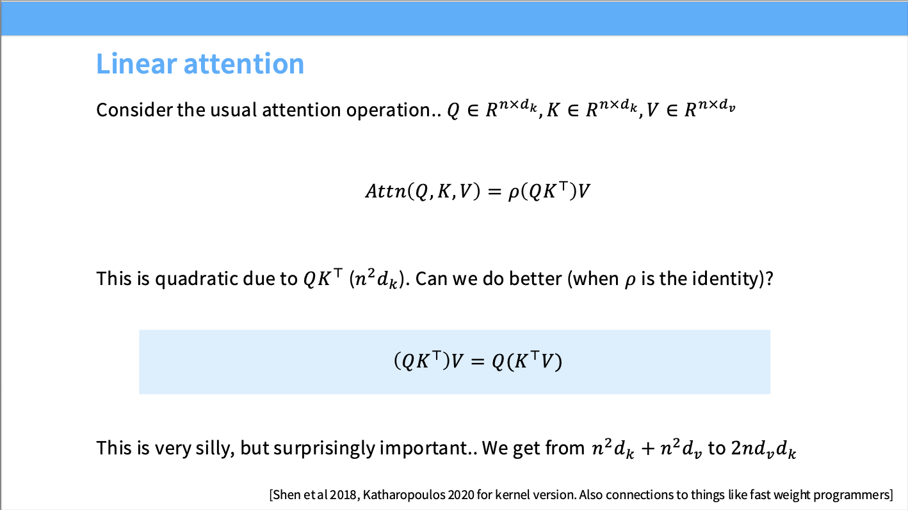
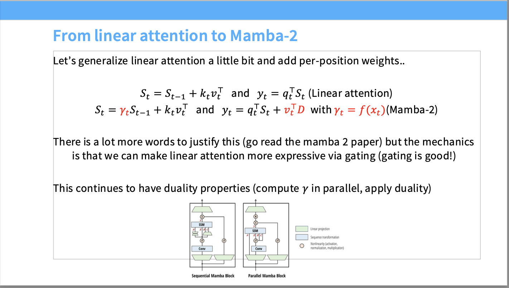
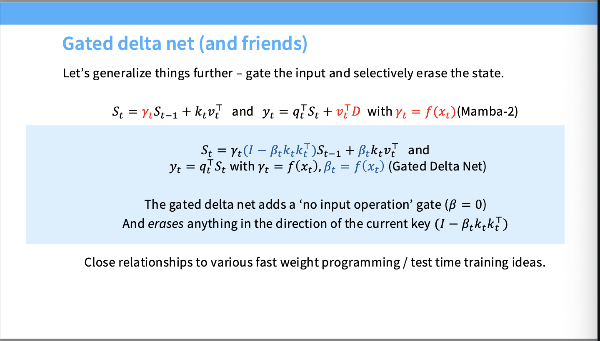
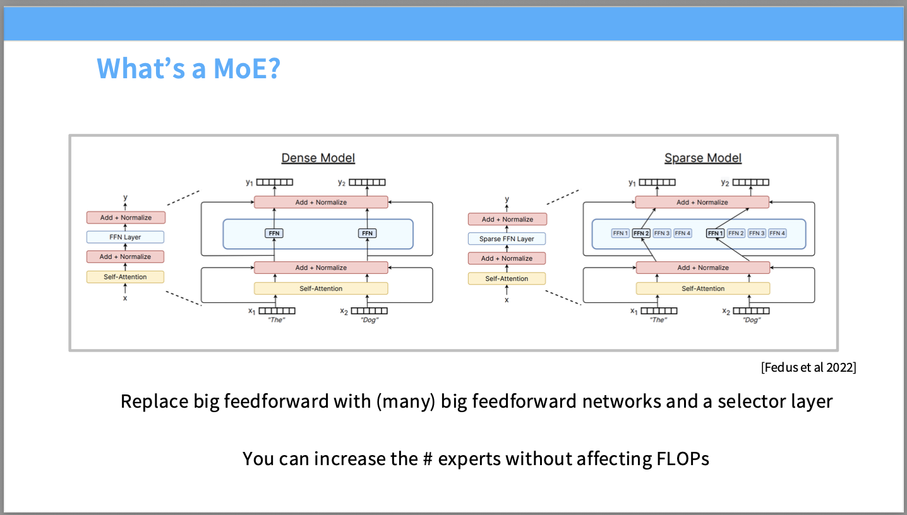
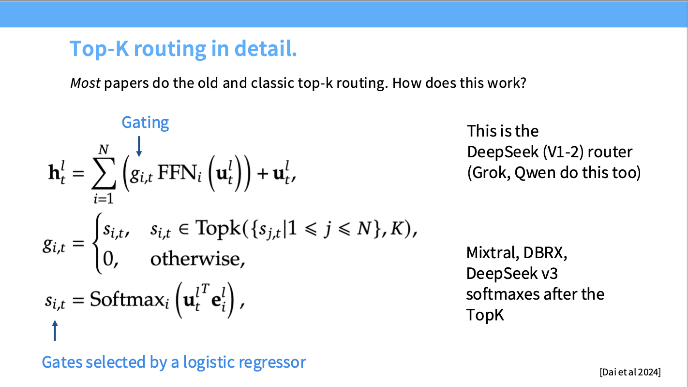

# Lecture4 Attention Alternatives and Mixtures of Experts

随着seq_length的增加，attention模块在cost中的消耗占比越来越大，比ffn所消耗大得多，因此我们要寻找attention模块的替代。

在长文本处理中，我们有两条根本路径：Systems Engineering and Algorithmic Restructuring

**系统工程 (Systems engineering - FlashAttention)**

- **核心思路：** 不动原本的数学公式，而是通过底层的 CUDA 编程，优化 GPU 的内存读写层级（IO-Aware）。
- **图表解析：随着序列长度（Sequence length）增加到 8k、16k，标准的 PyTorch 实现直接 OOM（显存溢出），而 **FlashAttention-2** 依然保持着极高的吞吐量。
- **局限性：** 尽管极大地降低了常数项和显存占用，但它**并没有改变 $O(N^2)$ 的时间复杂度本质**。

**算法上的“偷工减料” (Combine local + global attention)**

- **核心思路：** 既然让每个 Token 都关注所有历史 Token 太贵了，那就规定只有特定模式的交互。图中的矩阵展示了经典的稀疏注意力（Sparse Attention）模式，比如只关注相邻的局部 Token（滑动窗口）、或者设置几个全局 Token（如 Longformer 的做法）。
- **局限性：** 虽然理论上降低了 FLOPs，但现代 GPU 对这种不规则的稀疏内存访问非常不友好，实际加速效果往往大打折扣，并且会损失长距离的精确检索能力。



在传统的记忆力模块，$Q \in \mathbb{R}^{n \times d_k}$，$K \in \mathbb{R}^{n \times d_k}$。当计算 $QK^\top$ 时，我们会得到一个 $n \times n$ 的庞大注意力矩阵。这就是 $O(n^2 d_k)$ 复杂度的来源（$n$ 即序列长度）。因为中间卡了一个非线性的 Softmax 函数 $\rho$，这个括号是“锁死”的，你必须先算出这 $n \times n$ 的全连接关系。

**那么如果我们去掉 Softmax，让 $\rho$ 变成恒等映射呢？**

注意，softmax其实是会让模型变得不稳定，删除了softmax甚至还增加了模型的stability

矩阵乘法是满足结合律的，这就引出了那个蓝框里的核心公式：

$$(QK^\top)V = Q(K^\top V)$$

1. 先算 $K^\top V$：维度是 $(d_k \times n) \times (n \times d_v)$，得到一个 $d_k \times d_v$ 的小矩阵。这步复杂度是 $O(n \cdot d_k \cdot d_v)$。
2. 再算 $Q \times (K^\top V)$：维度是 $(n \times d_k) \times (d_k \times d_v)$，得到最终的 $n \times d_v$ 输出。这步复杂度也是 $O(n \cdot d_k \cdot d_v)$。

**结论：** 整体计算复杂度从关于序列长度的平方 $O(n^2)$，瞬间降级成了**线性 $O(n)$**（幻灯片底部的 $2nd_v d_k$）。

当我们在计算$(K^\top V)$的时候，我们实际上在维护一个固定大小的状态矩阵。这使得模型在推理时可以像 RNN 一样，每一个时间步只更新这个状态并读取它，从而实现 $O(1)$ 的推理成本。

通过$$S_t = S_{t-1} + k_t v_t^\top$$，$$y_t = q_t^\top S_t$$，只要$S_t$还在，k和v就可以删除，记忆仍然存在。看起来和RNN相识。

Minimax M1使用了每7层linear就叠加一层full的attention layer的策略。

### Mamba-2架构



解决了一个问题：如何通过引入数据依赖的门控机制（Gating），在保持计算复杂度为 $O(N)$ 的前提下，赋予线性模型媲美标准 Softmax 注意力机制的表达能力。

标准线性注意力的局限性在于，累加是无差别的，$S_t$ 是历史上所有 $k v^\top$ 的纯粹等权累加（Uniform Accum加），这意味着模型**无法主动遗忘**不重要的历史信息，也无法根据当前语境强调特定的过去标记。这极大限制了模型的上下文过滤能力。

Mamba-2引入了逐位置的权重

$$S_t = \gamma_t S_{t-1} + k_t v_t^\top$$   $$y_t = q_t^\top S_t + v_t^\top D$$

其中

$$\gamma_t = f(x_t)$$

$\gamma_t = f(x_t)$作为门控，模型现在可以动态决定：如果当前 token $x_t$ 遇到一个新的语境边界（比如句号或新段落），它可以让 $\gamma_t$ 接近于 0，从而“清空”历史状态 $S_{t-1}$；如果当前信息是需要持续保留的实体名称，它可以让 $\gamma_t$ 接近于 1，从而原封不动地传递信息。这种**数据依赖的遗忘/保留能力**，使得模型具有了动态分配注意力的表现力。

公式中的 $v_t^\top D$ 类似残差连接，用于将当前步的特征直接传递给输出，有助于梯度的稳定传播。

同时，可以并行计算。虽然 $S_t$ 看起来是顺序依赖的，但因为这里的运算是线性的，且 $\gamma_t$ 虽然依赖于 $x_t$ 但在训练时整个序列的 $x_1 \dots x_T$ 都是已知的，我们可以**并行地计算出所有的 $\gamma_t$**。随后，利用硬件感知的前缀和算法（Parallel Associative Scan）或结构化矩阵乘法，可以在 GPU 上高度并行地一次性计算出所有的 $S_t$ 和 $y_t$。

### Gated delta net



Mamba-2的机制存在缺陷，它的遗忘是全局且无差别的。当模型写入新的键值对 $k_t v_t^\top$ 时，它只是简单地将新信息累加进去。随着序列变长，不同的键向量在有限维度的状态矩阵 $S_t$ 中会发生叠加，导致信息相互干扰，检索精度下降。

为了实现更精准的记忆管理，Gated Delta Net 引入了如下更新规则：

$$S_t = \gamma_t(I - \beta_t k_t k_t^\top)S_{t-1} + \beta_t k_t v_t^\top$$

$$y_t = q_t^\top S_t$$

- **输入门控 (Input Gating - $\beta_t$):**

公式中的 $\beta_t = f(x_t)$ 是一个基于当前输入生成的标量门控。正如幻灯片中所指出的，它提供了一个“无输入操作”门（"no input operation" gate, 即 $\beta = 0$）。这意味着模型学会了判断当前的 token 是否包含有价值的新信息。如果是冗余的停顿词，$\beta_t$ 会趋近于 0，模型将拒绝写入任何新信息，从而节省了有限的记忆容量。

- **选择性擦除 (Selective Erasure - $I - \beta_t k_t k_t^\top$):**

这是 Delta Net 的灵魂所在。在将新的内容 $v_t$ 绑定到键 $k_t$ 并写入状态 $S$ 之前，模型会先执行操作 $(I - \beta_t k_t k_t^\top)S_{t-1}$。

从线性代数的角度来看，这相当于在状态矩阵 $S_{t-1}$ 中，**减去历史状态在当前键 $k_t$ 方向上的投影**。用通俗的语言解释：如果模型现在要更新关于某个特定实体的状态（新的 $k_t v_t^\top$），它会先在记忆库中精准抹除掉该实体旧有的、过时的信息，然后再写入新值。这种机制极大地减少了不同键值对之间的灾难性干扰（Catastrophic Interference）。

#### 几个疑问：

### 1. 为什么之前的记忆 $S_{t-1}$ 要乘以 $k_t k_t^\top$？（揭秘选择性擦除的几何本质）

在公式中，选择性擦除项是 $(I - \beta_t k_t k_t^\top)S_{t-1}$。我们把它展开，变成：

$$S_{t-1} - \beta_t k_t k_t^\top S_{t-1}$$

我们要搞清楚减去的那一坨 **$k_t k_t^\top S_{t-1}$** 到底是什么。让我们利用矩阵乘法的结合律，加一个括号：

$$k_t (k_t^\top S_{t-1})$$

奇迹就在这个括号里：

- **读取旧记忆 ($k_t^\top S_{t-1}$)**：在注意力机制中，状态矩阵 $S$ 的本质是一个“键值对（Key-Value）数据库”。当我们用当前的键 $k_t^\top$ 去乘历史状态 $S_{t-1}$ 时，系统实际上是在执行一次查询（Query）操作：**“嘿，记忆库，看看你之前有没有存过关于 $k_t$ 的信息？如果有，它对应的值（Value）是什么？”** 我们假设这个查询出来的旧值是 $v_{old}^\top$。
- **构建擦除矩阵 ($k_t v_{old}^\top$)**：现在，我们把查出来的旧值 $v_{old}^\top$ 和当前的键 $k_t$ 再做一次外积。这生成了一个特定维度的矩阵，这个矩阵代表了**仅仅属于 $k_t$ 这一条特征的旧记忆**。
- **执行擦除**：用总记忆 $S_{t-1}$ 减去这个特定矩阵，就相当于在数据库中**精准定位并删除了** $k_t$ 对应的旧记录，而完全不影响其他键（比如 $k_1, k_2$）存储的记忆。

这在数学上叫做**向 $k_t$ 方向的投影与正交化（Projection and Orthogonalization）**

### 2. 为什么 $\beta_t$ 越接近 1（输入越有意义），反而要遗忘更多的旧记忆？

现在你已经知道 $(k_t k_t^\top)S_{t-1}$ 就是“旧记忆”了。我们把完整的更新公式（暂时忽略 $\gamma_t$）写出来：

$$S_t = S_{t-1} - \beta_t k_t (k_t^\top S_{t-1}) + \beta_t k_t v_t^\top$$

假设 $k_t^\top S_{t-1} = v_{old}^\top$（旧值），公式就变成了：

$$S_t = S_{t-1} - \beta_t k_t v_{old}^\top + \beta_t k_t v_t^\top$$

合并同类项：

$$S_t = S_{t-1} + \beta_t k_t (v_t^\top - v_{old}^\top)$$

这个公式极其优雅，它被称为机器学习中经典的 **Delta 规则（误差修正学习）**！

**解答你的疑问：**

$\beta_t$ 是“输入门控”，代表我们有多想把当前的新值 $v_t$ 写入关于 $k_t$ 的记忆中。

如果 $\beta_t = 1$，代表“这个新输入 $v_t$ 是绝对的真理，我必须立刻记住它”。

**为了完美地记住新值 $v_t$ 并防止它和旧值发生混淆（干扰），你必须 100% 彻底地把旧值 $v_{old}^\top$ 擦除掉。**

这就好比你在电脑里覆盖保存一个同名文件（键都是 $k_t$）。如果你确认要保存新版本（$\beta_t \to 1$），系统就会把旧版本彻底删除（遗忘更多）。如果你觉得新信息只是一点点补充（$\beta_t$ 很小），系统就会保留大部分旧文件，只把新信息稍微融合进去。

### 3. 既然有了精准的选择性擦除，为什么还需要全局衰减门控 $\gamma_t$？

你可能会想：既然我能精准删除冲突的旧知识，为什么还要一个全盘衰减的 $\gamma_t$ 呢？

原因有两点（分为算法层面和物理系统层面）：

- **算法层面：处理“上下文边界 (Context Boundaries)”**

  选择性擦除只能删除**与当前输入 $k_t$ 发生冲突**的特定历史。但如果模型正在阅读一本书，突然翻到了新的一章，或者从讨论“量子物理”突然跳到了“如何做红烧肉”。此时，**之前所有的记忆即使不冲突，也变得毫无用处了（Out of context）**。

  这时候，精准擦除就显得太慢、太笨了。模型需要一个“一键清空”或者“快速褪色”的按钮。如果当前 token $x_t$ 是一个段落结束符（如 `\n\n`），模型可以让 $\gamma_t \to 0$，瞬间清空整个 $S_{t-1}$，轻装上阵迎接新话题。

- **系统物理层面：防止数值爆炸 (Numerical Stability)**

  状态矩阵 $S_t$ 的容量是有限的。尽管有选择性擦除，但在处理数十万 token 的长文本时，不断地进行矩阵加减法，某些维度的数值由于浮点数的累积效应，仍然可能发生漂移或膨胀，导致 `NaN` 或 `Inf`。

  $\gamma_t$（通常被限制在 $0$ 到 $1$ 之间）提供了一个**全局的阻尼（Damping）机制**。即使没有遇到段落边界，让 $\gamma_t = 0.999$，也能确保那些久远且长时间未被访问的记忆缓慢衰减，从而保证整个状态矩阵的数值范数（Norm）被稳定在一个健康的物理范围内。

### 动态稀疏注意力（Dynamic Sparse Attention, DSA）

本质是，**不要让每个 query 去关注历史上的所有 token，而是只关注对它最有用的那一小部分。**避免标准注意力机制 $O(N^2)$ 的计算瓶颈，同时又不依赖混合架构（如 Attention + SSM/Mamba）

$$I_{t,s} = \sum_{j=1}^{H^I} w_{t,j}^I \cdot \text{ReLU}\left( \mathbf{q}_{t,j}^I \cdot \mathbf{k}_s^I \right)$$

这里计算的是当前查询 token $\mathbf{h}_t$ 与历史 token $\mathbf{h}_s$ 之间的相关性得分 $I_{t,s}$

在获得了所有历史 token 的得分 $I_{t,s}$ 后，系统会执行 Top-k 路由：

$$\mathbf{u}_t = \text{Attn}(\mathbf{h}_t, \{\mathbf{c}_s \mid I_{t,s} \in \text{Top-k}(I_{t,:})\})$$

模型只提取得分排名前 $k$ 的那些历史上下文键值对（key-value entries, 表示为 $\mathbf{c}_s$）。然后，标准的（且沉重的）注意力机制只在这个极小的子集上进行计算。

通过这种方式，原本关于序列长度 $N$ 呈二次方 $O(N^2)$ 增长的注意力计算，被硬性截断为了线性或接近线性的复杂度 $O(N \cdot k)$。

我们**不需要从头开始训练**一个支持 128k 长文本的稀疏模型。你可以先用标准的方法在短上下文（比如 4k）上进行密集的预训练（Dense short context pretraining），然后在这个预训练模型的基础上，插入这个轻量级的索引器，通过低成本的微调（Fine-tuning），将其快速“扩展”为长上下文模型。这种方法极大地节省了训练集群的算力成本。

# MoE



架构如图，可以在不增加FLOPs的前提下，几乎白嫖参数容量。

并且，由于MoE有不同的Experts， 并且每个Expert可以独立训练，这使得MoE模型在分布式训练中更具优势。我们可以将不同的Experts分配到不同的计算节点上，从而更好地利用分布式计算资源，提高训练效率。

接下来分为三点来介绍MoE的架构，分别为Routing Fuction：路由机制，Experts sizes：多个独立的FFN Layer，每个Expert负责处理一部分token，Training Objectives：MoE模型的训练目标和损失函数设计。

## Routing Fuction

分为token选专家，专家选token，global assignment

- T-C模式的routing，需要每个token对专家打分，选取top-K专家来处理这个token，有以下四个实现方式
- Top-K Gating：使用一个线性层对 token 的 hidden state 进行投影，得到每个专家的分数，然后选择 top-K 个专家。
- Hashing-based Routing：使用哈希函数将 token 映射到专家，从而实现路由（通常作为Baseline）。
- RL to learn Routing：使用强化学习方法来学习路由策略。
- Solve a Optimization Problem：将路由问题视作一个优化问题，通过求解该问题来确定路由结果。



Top-K计算过程如图，首先计算专家得分，并且转化为概率分布。$$s_{i,t}=Softmax_{i}(u_{t}^{lT}e_{i}^{l})$$

接着使用top-k截断，$$g_{i,t}=\begin{cases}s_{i,t},&s_{i,t}\in Topk(\{s_{j,t}|1\le j\le N\},K),\\ 0,&otherwise,\end{cases}$$

最后，计算加权得分和残差连接。$$h_{t}^{l}=\sum_{i=1}^{N}(g_{i,t}FFN_{i}(u_{t}^{l}))+u_{t}^{l}$$

后来的模型，一般先不做softmax，先把logits做top-k选择之后，再做top-k。

DeepSeek提出了共享专家，在众多微型专家中，单独拿出一个或几个专家作为“共享专家”。这个专家的特权是：**它不经过路由器，对所有的 Token 永远保持激活状态** 。剩下的 Token 则由路由器在剩余的路由专家中挑选 $K=3$ 个（保持总激活数为 4）

## MoE Experts

每个Expert由一个前馈神经网络构成，其中间层维度通常设置为4$d_{model}$,同时DeepSeek介绍了Fine-Grained Experts的概念，即通过增加Experts的数量，同时减少每个Expert的中间层维度，从而提升模型的表达能力。

## How do we train MoEs？

如果我们只使用传统的loss来训练moe模型，很容易发生负载均衡问题，一个专家一直被激活，而其他专家饿死。

MoE的forward很简单，难点在于训练时如何避免expert collapse，如何让专家负载均衡

## Heuristic Balancing Losses

这是最常见的loss方法，在原loss的基础上添加辅助损失，来使专家负载均衡。简单分为两种，Load Balancing loss以及z_loss

### Load Balancing Loss

$$\text{loss} = \alpha \cdot N \cdot \sum_{i=1}^N f_i \cdot P_i$$

这是加到模型总 Loss 里的额外惩罚项。$\alpha$ 是一个很小的超参数（控制惩罚力度），$N$ 是专家总数。

$$f_i = \frac{1}{T} \sum_{x \in \mathcal{B}} 1\{\text{argmax } p(x) = i\}$$

这个公式统计了在当前批次（包含 $T$ 个 Token）中，**实际上**有多少比例的 Token 被分配给了第 $i$ 个专家。

$$P_i = \frac{1}{T} \sum_{x \in \mathcal{B}} p_i(x)$$

这是路由器对第 $i$ 个专家输出的**预测概率**的平均值。这是一个连续且可导的变量。

如果大量 Token 拥挤在一个专家上（例如 $f_1 \approx 1, P_1 \approx 1$），这个点积的值就会急剧变大，从而产生巨大的 Loss 惩罚。

deepseek加了设备级平衡，$$\mathcal{L}_{\text{DevBal}} = \alpha_2 \sum_{i=1}^D f'_i P'_i$$

DeepSeek v3 提出了一个“无辅助损失平衡”策略：

$$g'_{i,t} = \begin{cases} s_{i,t}, & s_{i,t} + b_i \in \text{Topk}(\{s_{j,t} + b_j | 1 \leqslant j \leqslant N_r\}, K_r), \\ 0, & \text{otherwise}. \end{cases}$$

**在线学习（Online Learning）：** 如果系统发现某个专家快要被饿死了，就在后台悄悄调高它的 $b_i$；如果某个专家太忙，就调低它的 $b_i$。这相当于给冷门专家开了“绿灯”。

### z_loss

Z-Loss 是另一种常用的辅助损失，旨在鼓励路由器的输出分布更加均匀。对于给定的门控输入 `logits`（进入 Softmax 之前的原始分数），Z-loss 的公式定义为：

$$L_z = \frac{1}{B \times S} \sum_{b=1}^{B} \sum_{s=1}^{S} \left( \ln \sum_{j=1}^{E} e^{x_{b,s,j}} \right)^2$$

**$B$**：Batch Size（批次大小）

**$S$**：Sequence Length（序列长度）

**$E$**：Expert Number（专家总数）

**$x_{b,s,j}$**：第 $b$ 个 Batch 的第 $s$ 个 Token，对第 $j$ 个专家的原始 `logit` 分数。

```python
log_sum_exp = torch.logsumexp(logits, dim=-1)  # 对应公式里的 ln(sum(e^x))
z_loss = torch.mean(log_sum_exp**2)            # 平方后求均值
```

我们知道，门控概率是通过 Softmax 计算的：

$$P_i = \frac{e^{x_i}}{\sum_{j} e^{x_j}}$$

数学上，**Softmax 只关心 `logits` 之间的相对差值，而不关心绝对大小**。

例如，`logits = [1, 2, 3]` 和 `logits = [101, 102, 103]` 算出来的 Softmax 概率分布是**完全一模一样**的。

这就带来了一个漏洞：由于标准损失函数（如交叉熵）只看 Softmax 后的概率，导致网络在反向传播时，**没有任何力量去约束 `logits` 的绝对大小**。随着模型越练越深，`logits` 的绝对值可能会漂移到非常大（例如变成 500 甚至 1000）

仔细观察 `logsumexp` 的数学特质：

$$\ln \sum_{j=1}^{E} e^{x_j} \approx \max(x_1, x_2, ..., x_E)$$

当其中某一个 `logit` 显著大于其他值时，`logsumexp` 的值非常接近这个**最大值**。

因此，对 `logsumexp` 求平方并作为惩罚项（Loss），本质上就是在**惩罚那个绝对值最大的 logit**。它强迫门控网络输出的所有 `logits` 都尽量靠近 0 附近，不要出现极端的大数。


