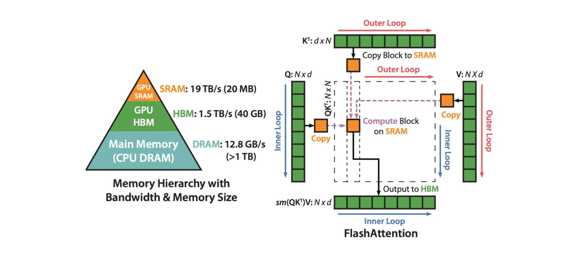
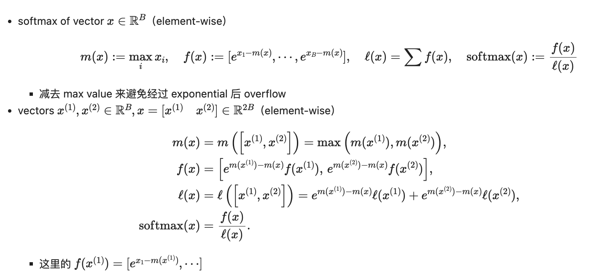

# FlashAttention



标准的attention操作在计算注意力的时候会产生巨大的 $N \times N$ 注意力分数矩阵，而SRAM根本装不下。因此，标准的Attention操作是一个典型memory-bound操作，需要将qk从HBM读到SRAM，计算S之后再写回到HBM，以及多次类似的读写也发生在计算softmax中，这也主要是因为我们需要这些intermediate activations帮助我们来在backward计算gradients。这些operation都需要所有row的element都到齐之后才可以计算，而sram显然无法装下这么大的数据量。

## FlashAttention做了什么？

### 1、Tiling

这是 FlashAttention 最底层的系统设计。 既然 SRAM 装不下完整的 $N \times N$ 矩阵，那就把它切碎。FlashAttention 将输入的 $Q, K, V$ 矩阵沿着序列长度 $N$ 切分成很小的块（Blocks），使其刚好能塞进那 20MB 的 SRAM 中。 在 SRAM 内部，用极高的带宽迅速完成小块的矩阵乘法，并**直接得出最终的输出块写回 HBM，绝不保存中间的 $S$ 和 $P$ 矩阵**。在flashattention2中，我们一般以q为外循环，kv为内循环来计算。

### 2、Online Softmax

分块计算带来了一个致命问题：Softmax 函数需要知道**全局**的最大值和分母总和才能进行归一化。如果你只把一块数据拿进了 SRAM，你怎么算 Softmax 呢？

FlashAttention 引入了一套巧妙的数学更新规则。当我们读入一个新的 Block 时：

1. **更新全局最大值**：找出新块和旧块中更大的那个作为当前最新的最大值。

2. **修正历史数据**：利用指数的数学性质（$e^{a-c} = e^{a-b} \cdot e^{b-c}$），给之前算出来的旧的分母和输出乘上一个**修正系数**（旧最大值与新最大值的差的指数），将它们无缝拉回到最新的同一尺度上。

   通过这种不断修正的接力，等所有块都遍历完时，我们就能得到与全局计算 100% 精确匹配的 Softmax 结果



1. **更新全局最大值 $m(x)$**：

   当前全局最大值，就是“旧块的最大值”和“新块的最大值”中更大的那一个。

   $$m(x) = \max(m(x^{(1)}), m(x^{(2)}))$$

2. **修正历史指数值 $f(x)$**：

   当我们用 $x^{(1)}$ 计算 $f(x^{(1)})$ 时，我们减去的是当时的局部最大值 $m(x^{(1)})$。

   但现在有了新数据，全局最大值可能变了。我们不需要重新把 $x^{(1)}$ 从显存里读出来重算。根据指数运算规则 $e^{a-c} = e^{a-b} \cdot e^{b-c}$，我们只需要给旧结果乘上一个**修正系数**：$e^{\text{旧最大值} - \text{新最大值}}$。

   $$f(x) = [e^{m(x^{(1)}) - m(x)} f(x^{(1)}), \dots]$$

3. **修正历史分母 $\ell(x)$**：

   同理，旧的分母也需要乘上这个修正系数，然后加上新块的分母。

   $$\ell(x) = e^{m(x^{(1)}) - m(x)} \ell(x^{(1)}) + e^{m(x^{(2)}) - m(x)} \ell(x^{(2)})$$

4. **最终输出**：

   所有块都遍历完后，我们用最终修正好的 $f(x)$ 和 $\ell(x)$ 相除，就能得到完美的 Softmax 结果

### 3、Recomputation

这一点发生在backward时，在训练模型进行反向传播时，我们需要用到前向传播生成的概率矩阵 $P$ 来算梯度。 如果不保存 $P$（为了省 $O(N^2)$ 显存），反向传播怎么办？ FlashAttention 的策略是：**在前向传播结束时，只在 HBM 中保存一个极小的一维向量——LogSumExp（即每一行 Softmax 分母的对数，占用 $O(N)$ 显存）。** 到了反向传播时，GPU 再次读取 $Q, K, V$，利用这个存好的 LogSumExp 向量，直接在极快的 SRAM 中**瞬间重新算出**对应的 $P$ 矩阵，用极小的计算代价换取了巨大的显存空间。

如何计算？

其中$$S_i^{(j)} = \frac{Q_i (K^{(j)})^\top}{\sqrt{d}}$$

$$L_i = m_i + \log\left(\sum_{j} \exp(S_{ij} - m_i)\right)$$

$$L_i = \log(\exp(m_i)) + \log\left(\sum_{j} \exp(S_{ij} - m_i)\right)$$

$$L_i = \log\left(\exp(m_i) \cdot \sum_{j} \exp(S_{ij} - m_i)\right)$$

$$L_i = \log\left(\sum_{j} \exp(m_i) \cdot \exp(S_{ij} - m_i)\right)$$

$$L_i = \log\left(\sum_{j} \exp(S_{ij})\right)$$

$L_i$ 在数学上等于所有原始注意力分数指数之和的对数，**采用 $m_i + \log(l_i)$ 这种形式来计算，是为了**数值稳定性，防止算 $\exp(S_{ij})$ 时直接溢出。

在backward时候，我们不想再次计算$S_i^{(j)}$,这会耗费很大的计算资源。

此时，$$P_{ij} = \frac{\exp(S_{ij})}{\sum \exp(S_i)}$$

$$\log(P_{ij}) = S_{ij} - \log\left(\sum \exp(S_i)\right)$$

$$\log(P_{ij}) = S_{ij} - L_i$$

$$P_{ij} = \exp(S_{ij} - L_i)$$

因为我们在前向传播时花了一丁点代价计算了 $L_i$ 并存入了显存，所以在反向传播时，我们只需要：

1. 重新算出局部的 $S_{ij} = Q_i K_j^\top / \sqrt{d}$。
2. 从显存里读出已经算好的标量 $L_i$。
3. 直接计算 $P_{ij} = \exp(S_{ij} - L_i)$。

原本如果没有$L_i$,我们必须存下巨大的矩阵P，或者做两次遍历，再次计算qk计算出s。但是现在有了$L_i$之后，我们只需要存一个长度为N的向量进入HBM。

## Flash Attention的Torch以及Triton实现

### Torch版本

```python
class FlashAttentionV2Torch(torch.autograd.Function):
    @staticmethod
    def forward(ctx,Q,K,V,is_causal = False):
        """
        FlashAttention-2前向传播实现
        参数:
            query: [batch_size, seq_len_q, head_dim]
            key: [batch_size, seq_len_k, head_dim]
            value: [batch_size, seq_len_k, head_dim]
            is_causal: mask
        返回:
            output: [batch_size, seq_len_q, head_dim]
        """
        Bq,Bk = 16,16
        B,seq_len_q,d = Q.shape
        _,seq_len_k,d = K.shape
        Tq = ceil(seq_len_q / Bq)
        Tk = ceil(seq_len_k / Bk)
        O = torch.zeros_like(Q)
        L = torch.zeros(B,seq_len_q,device = Q.device,dtype = Q.dtype)

        for i in range(Tq):
            start_q = i * Bq
            end_q = min(start_q+Bq,seq_len_q)
            q_len = end_q - start_q # 当前块的真实长度
            Q_i = Q[:,start_q:end_q,:]
            oi = torch.zeros((B,q_len,d), dtype=Q.dtype, device=Q.device)
            li = torch.zeros((B,q_len,1), dtype=Q.dtype, device=Q.device)
            mi = torch.full((B, q_len,1), -float('inf'), dtype=Q.dtype, device=Q.device)

            for j in range(Tk):
                start_k = j * Bk
                end_k = min(start_k + Bk,seq_len_k)
                K_j,V_j = K[:,start_k:end_k,:],V[:,start_k:end_k,:]
                S_ij = einsum(Q_i,K_j,"b s1 d, b s2 d -> b s1 s2") / math.sqrt(d)
                m_ij = torch.max(mi,torch.amax(S_ij, dim=-1, keepdim=True))
                p_ij = torch.exp(S_ij-m_ij)
                exp_diff = torch.exp(mi-m_ij)
                li = exp_diff*li+torch.sum(p_ij,dim = -1,keepdim = True)
                oi = exp_diff * oi + einsum(p_ij,V_j,"b s1 s2, b s2 d->b s1 d")
                mi = m_ij
            O_i = oi / li
            L_i = mi + torch.log(li)
            O[:,start_q:end_q, :] = O_i.to(Q.dtype)
            L[:,start_q:end_q] = L_i.squeeze(-1)
        ctx.q_shape = Q.shape  
        ctx.k_shape = K.shape  
        ctx.v_shape = V.shape  
        ctx.is_causal = is_causal
        ctx.save_for_backward(L, Q, K, V, O)

        ctx.is_causal = is_causal
        return O
```

pytroch版本只是为了数学理解使用，实际无法控制sram并且频繁搬运数据于hbm和sram之间，效率低于普通的attention

### Triton版本

```
@triton.jit
def flash_fwd_kernel(
    Q_ptr, K_ptr, V_ptr,
    O_ptr, L_ptr,
    stride_qb, stride_qq, stride_qd,
    stride_kb, stride_kk, stride_kd,
    stride_vb, stride_vk, stride_vd,
    stride_ob, stride_oq, stride_od,
    stride_lb, stride_lq,
    N_QUERIES, N_KEYS,
    # Q，K序列总长度
    scale,
    D: tl.constexpr,
    # Head Dimension
    Q_TILE_SIZE: tl.constexpr,
    K_TILE_SIZE: tl.constexpr,
    is_causal: tl.constexpr,
):
    # 程序索引
    # GPU看到的只是一段连续的一维内存地址 
    # Triton 通过步长 (Strides) 和make_block_ptr来帮助我们在这一维内存中精准地切出我们想要的数据块
    query_tile_index = tl.program_id(0)
    batch_index = tl.program_id(1)

    # 用相应的批次索引偏移每个指针
    # # 乘以每个张量的批次步幅 (batch stride)
    # 创建一个分块指针对象，在 GPU 显存中定义一个虚拟的二维网格，并指定我们要读取这个网格中的block
    Q_block_ptr = tl.make_block_ptr(
        Q_ptr + batch_index * stride_qb,
        shape=(N_QUERIES, D),
        strides=(stride_qq, stride_qd),
        offsets=(query_tile_index * Q_TILE_SIZE, 0),
        block_shape=(Q_TILE_SIZE, D),
        order=(1, 0),
    )
    K_block_ptr = tl.make_block_ptr(
        K_ptr + batch_index * stride_kb,
        shape=(N_KEYS, D),
        strides=(stride_kk, stride_kd),
        offsets=(0, 0),
        block_shape=(K_TILE_SIZE, D),
        order=(1, 0),
    )
    V_block_ptr = tl.make_block_ptr(
        V_ptr + batch_index * stride_vb,
        shape=(N_KEYS, D),
        strides=(stride_vk, stride_vd),
        offsets=(0, 0),
        block_shape=(K_TILE_SIZE, D),
        order=(1, 0),
    )
    O_block_ptr = tl.make_block_ptr(
        O_ptr + batch_index * stride_ob,
        shape=(N_QUERIES, D),
        strides=(stride_oq, stride_od),
        offsets=(query_tile_index * Q_TILE_SIZE, 0),
        block_shape=(Q_TILE_SIZE, D),
        order=(1, 0),
    )
    L_block_ptr = tl.make_block_ptr(
        L_ptr + batch_index * stride_lb,
        shape=(N_QUERIES,),
        strides=(stride_lq,),
        offsets=(query_tile_index * Q_TILE_SIZE,),
        block_shape=(Q_TILE_SIZE,),
        order=(0,),
    )
    # 加载当前线程块负责的Q
    q = tl.load(Q_block_ptr)

    m_i = tl.full((Q_TILE_SIZE,), -float("inf"), dtype=tl.float32)
    l_i = tl.zeros((Q_TILE_SIZE,), dtype=tl.float32)
    o_i = tl.zeros((Q_TILE_SIZE, D), dtype=tl.float32)
    T_k = tl.cdiv(N_KEYS,K_TILE_SIZE)
    offs_q = query_tile_index * Q_TILE_SIZE + tl.arange(0, Q_TILE_SIZE)
    for j in range(T_k):
        kj,vj = tl.load(K_block_ptr), tl.load(V_block_ptr)
        s_ij = tl.dot(q,tl.trans(kj)) * scale
        if is_causal:
            # 计算当前 Key 块在整个序列中的真实索引
            offs_k = j * K_TILE_SIZE + tl.arange(0, K_TILE_SIZE)
            # 广播比较，生成掩码矩阵 (True 表示合法，False 表示需要被 Mask 掉的未来词)
            causal_mask = offs_q[:, None] >= offs_k[None, :]
            # 用 tl.where 将需要 Mask 的地方替换为 -inf
            s_ij = tl.where(causal_mask, s_ij, -float("inf"))
        m_ij = tl.max(s_ij, axis=-1)
        m_new = tl.maximum(m_i, m_ij)
        
        p_ij = tl.exp(s_ij - m_new[:,None])
        scaling_factor = tl.exp(m_i - m_new)
        m_i = m_new
        l_i = l_i * scaling_factor + tl.sum(p_ij,axis = -1)
        o_i = scaling_factor[:,None] * o_i +  tl.dot(p_ij.to(vj.dtype), vj)
        K_block_ptr = tl.advance(K_block_ptr,(K_TILE_SIZE,0))
        V_block_ptr = tl.advance(V_block_ptr,(K_TILE_SIZE, 0))
    o_i = (1 / l_i)[:, None] * o_i
    l_i = m_i + tl.log(l_i)
    tl.store(O_block_ptr, o_i.to(O_block_ptr.type.element_ty), boundary_check=(0, 1))
    tl.store(L_block_ptr, l_i, boundary_check=(0,))
    

class FlashAttentionV2Triton(torch.autograd.Function):
    @staticmethod
    def forward(ctx, Q, K, V, is_causal: bool = False):
        ctx.save_for_backward(Q,K,V)
        Bq, Bk = 16,16
        B,seq_len_q,D = Q.shape
        _,seq_len_k,D = K.shape
        N_QUERIES = seq_len_q
        N_KEYS = seq_len_k
        Tq = triton.cdiv(N_QUERIES, Bq)
        O = torch.empty((B, N_QUERIES, D), device=Q.device)
        L = torch.empty((B, N_QUERIES), device=Q.device)
        scale = 1 / math.sqrt(D)
        grid = (Tq,B)
        flash_fwd_kernel[grid](
            Q,
            K,
            V,
            O,
            L,
            Q.stride(0),
            Q.stride(1),
            Q.stride(2),
            K.stride(0),
            K.stride(1),
            K.stride(2),
            V.stride(0),
            V.stride(1),
            V.stride(2),
            O.stride(0),
            O.stride(1),
            O.stride(2),
            L.stride(0),
            L.stride(1),
            N_QUERIES,
            N_KEYS,
            scale,
            D,
            Q_TILE_SIZE=Bq,
            K_TILE_SIZE=Bk,
            is_causal=is_causal,
        )

        ctx.save_for_backward(L, Q, K, V, O)
        ctx.is_causal = is_causal
        return O
    
    @staticmethod
    def backward(ctx, dO):
        return FlashAttentionV2Torch.backward(ctx, dO)
        
```


