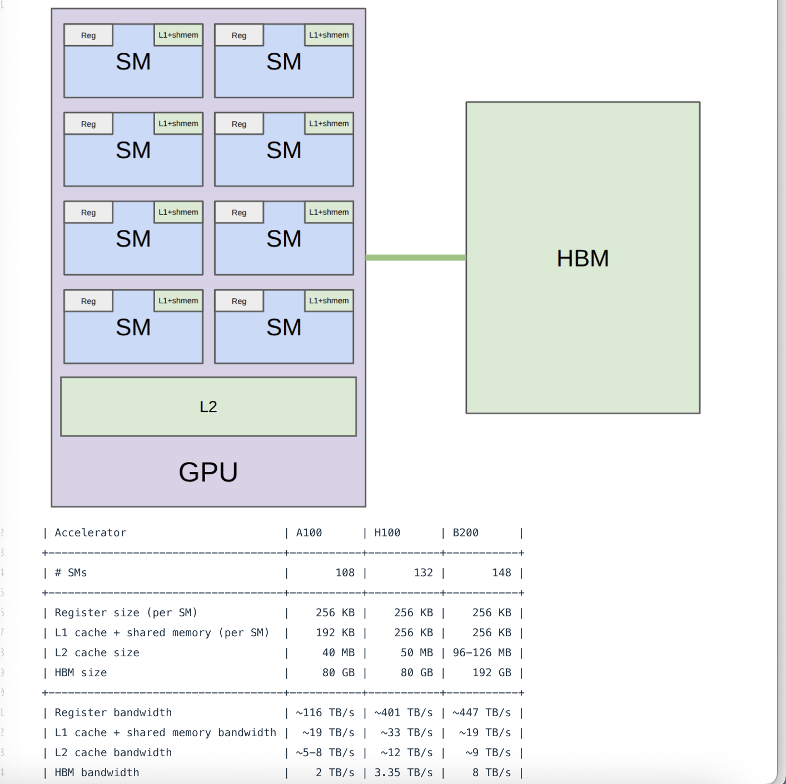
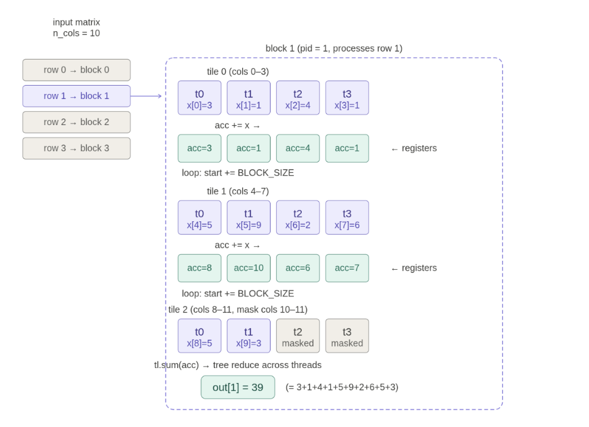

# Triton

1. #### L1 cache + shared memory

每一个物理 **SM内部**，都紧密集成了一块高速缓存，统称为 **L1 + shmem**。

**与 Block 的关系：** 在 NVIDIA GPU 架构中，**物理上的 L1 缓存和软件层面的“共享内存（Shared Memory）”共享同一块硬件片上高速 SRAM。**

**运行机制：** 当你启动一个 Block 并将其调度到某个 SM 上时，该 Block 申请的 `Shared Memory` 就会物理性地开辟在这个 SM 的 L1/shmem 区域里。同一个 Block 内的所有线程，都可以通过这块硬件极其快速地交换数据。

2. #### L2 cache（在 SM 外部，GPU 芯片内部）

GPU 芯片去读写右边那个绿色大框（HBM）是很慢的（带宽只有 2~8 TB/s）。为了加速，GPU 内部做了一个集中式的 L2 缓存。当不同的 SM 去访问 HBM 时，如果数据刚好在 L2 里，就不用大老远跑到 HBM 去拿了，L2 可以提供约 5~12 TB/s 的中等带宽。

线程块本质上是一组可以访问同一块共享内存的线程集合，一个线程块必须被作为一个整体，调度到一个SM上进行。

在Triton中，我们需要以线程块为单位来思考

GPU 的共享内存（Shared Memory）为了支持极高的并发读写，在物理层面被切分成了 32 个独立的存储体，也就是“Bank”。每个 Bank 的宽度是 4 字节（刚好能装下一个标准的 `float32` 浮点数）

GPU 中是以 Warp（包含 32 个连续线程）为单位执行任务的。在每一个时钟周期，这 32 个线程会同时去共享内存拿数据。

**最佳情况（完美并行）：** 如果这 32 个线程刚好去 32 个**不同的** Bank 拿数据，所有窗口同时服务，一回合直接搞定。

**最坏情况（强制串行/Bank Conflict）：** 如果有多个线程非要去**同一个** Bank 拿不同地址的数据（比如大家都挤在 0 号窗口），由于硬件限制一个窗口一次只能服务一个请求，这些操作就会被**强制排队处理（Serialized）**。这就是 Bank Conflict

当矩阵乘法的时候就会发生，需要按列来读取的时候，读取步长为32，不得不发生冲突

同时我们要确保启动的Thread Blocks总数是SM数量的整数倍，才能最好地利用硬件资源

一个Warp内的32个线程必须做一样的工作，Block内的warp运行同一份Kernel代码，但是不需要同步执行，它们相互独立，但又可以通过共享内存（Shared Memory）互相配合。如果你希望跑得快的 Warp B 等一等跑得慢的 Warp A，你必须在代码里显式地写下一条“屏障/同步”指令（在 CUDA 里叫 `__syncthreads()`，在 Triton 里由编译器隐式处理或者使用 `tl.debug_barrier()`）。只有遇到这行代码，先到的 Warp 才会停下来，等所有 Warp 都到了，大家再一起往下走。

在绝大多数深度学习算子中，为了最高效地利用 GPU，分配到同一个 SM 上的多个 Block 通常属于同一个 Grid（即同一个算子任务）。

### Benchmarking and Profiling

分为三种：Naive Gelu：包含各种 `BinaryFunctor`（二元操作，比如乘法）、`AUnaryFunctor`（一元操作）、`CUDAFunctor_add`（加法）、`tanh_kernel` 等。 极度的**内存受限（Memory-bound）**。GPU 的计算核心（ALU）大部分时间都在无聊地等待慢速显存搬运数据。

Built-in Gelu：只调用了 **1 次** `GeluCUDAKernelImpl`，这就是**算子融合（Kernel Fusion）**。消灭了所有中间变量的显存读写，耗时直接降到 305us。

Compiled Gelu：triton_poi_fused_add_mul_tanh_0，`torch.compile` 分析了你的 Naive Python 代码，发现“这里有一堆可以合并的数学公式”，然后它**自动在后台为你生成并编译了一个融合了加、乘、tanh 的 Triton 内核**

如果矩阵的一整行可以直接塞进一个Block里，那么就很简单，将每一行分配给一个block，然后计算。

而通常，llm的上下文长度很长，gpu的一个block通常最多只能容纳1024个线程，sram的容量也是有限的。

这时，我们就要使用Tiling

假设我们有 4096 个元素，但 Block 只有 1024 个线程。我们不能让多出来的 3072 个元素干等着，也不能跨 Block 去处理（因为跨 Block 无法通过高效的 SRAM 通信）

通过写一个 `for` 循环，让这1024个线程分批次地处理这 4096 个元素。

每个线程在自己的物理寄存器中开辟一个私有的累加器变量，最终求和。

